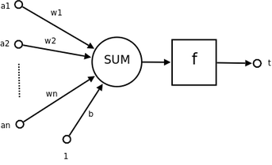

# 神經網路

人工神經網路，簡稱神經網路或是類神經網路，在機器領域與認知科學領域裡，是一種仿生物的神經網路系統(模仿類似大腦的系統)的結構和功能的數學模型
或是計算模型，用於對韓式進行估計或是近似。神經網路由大量的人工神經元聯結進行計算。大多數情況下人工神經網路能在外界資訊的基礎上改變內部結構
，是一種自適應系統，也就是具備學習功能。現代神經網路是一種非線性統計性資料建模工具，神經網路通常是通過一個基於數學統計學類型的學習方法
（Learning Method）得以最佳化，通過統計學的標準數學方法我們能夠得到大量的可以用函式來表達的局部結構空間，另一方面在人工智慧學的人工感知領
域，我們通過數學統計學的應用可以來做人工感知方面的決定問題（也就是說通過統計學的方法，人工神經網路能夠類似人一樣具有簡單的決定能力和簡單的
判斷能力），這種方法比起正式的邏輯學推理演算更具有優勢。

和其他機器學習方法一樣，神經網路已經被用於解決各種各樣的問題，例如機器視覺和語音辨識。這些問題都是很難被傳統基於規則的編程所解決的。

# 神經元網路

人工神經網路是一個能夠學習，能夠總結歸納的系統，也就是說它能夠通過已知資料的實驗運用來學習和歸納總結。人工神經網路通過對局部情況的對照比較（
而這些比較是基於不同情況下的自動學習和要實際解決問題的複雜性所決定的），它能夠推理產生一個可以自動辨識的系統。與之不同的基於符號系統下的學習
方法，它們也具有推理功能，只是它們是建立在邏輯演算法的基礎上，也就是說它們之所以能夠推理，基礎是需要有一個推理演算法則的集合。

一種常見的多層結構的前饋網路（Multilayer Feedforward Network）由三部分組成，

輸入層（Input layer），眾多神經元（Neuron）接受大量非線形輸入訊息。輸入的訊息稱為輸入向量。 輸出層（Output layer），訊息在神經元鏈接中傳輸、
分析、權衡，形成輸出結果。輸出的訊息稱為輸出向量。 隱藏層（Hidden layer），簡稱「隱層」，是輸入層和輸出層之間眾多神經元和鏈接組成的各個層面。
隱層可以有一層或多層。隱層的節點（神經元）數目不定，但數目越多神經網路的非線性越顯著，從而神經網路的強健性（robustness）（控制系統在一定結構、
大小等的參數攝動下，維持某些效能的特性）更顯著。習慣上會選輸入節點1.2至1.5倍的節點。 這種網路一般稱為感知器（對單隱藏層）或多層感知器（對多
隱藏層），神經網路的類型已經演變出很多種，這種分層的結構也並不是對所有的神經網路都適用。

# 神經元示意圖

# 資料來源
[神經網路維基百科](https://zh.wikipedia.org/wiki/%E4%BA%BA%E5%B7%A5%E7%A5%9E%E7%BB%8F%E7%BD%91%E7%BB%9C)
[神經元網路維基百科](https://zh.wikipedia.org/wiki/%E4%BA%BA%E5%B7%A5%E7%A5%9E%E7%BB%8F%E7%BD%91%E7%BB%9C)
