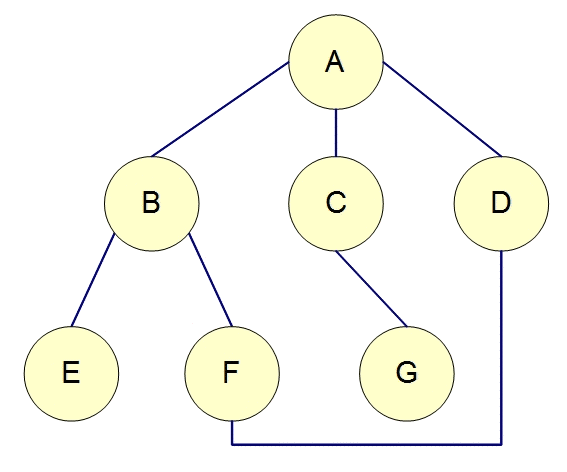

# 深度優先搜尋法

 深度優先搜尋法是一種會先把一個節點，也就是樹根，或者是說是把一個節點當作跟，把那個節點的子節點全部搜尋完才進入
 下一個分支的搜尋法，通常以遞迴的方式呈現。
 

# 廣度優先搜尋法

廣度優先則是另一種搜尋法，把搜尋樹以一層一層的方式由上往下把所有節點搜尋過一遍，而這個通常以迴圈的方式進行。

# 圖片與資源來源
[深度](http://simonsays-tw.com/web/DFS-BFS/DepthFirstSearch.html) 
[廣度](http://simonsays-tw.com/web/DFS-BFS/BreadthFirstSearch.html)
