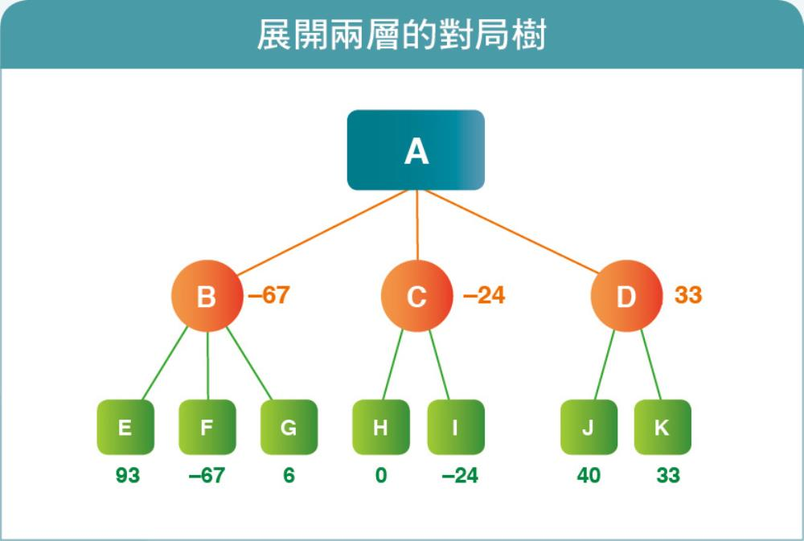

# 簡單的對局

電腦下棋，基本上像西洋棋、象棋或圍棋等是屬於「有限、雙人、完全資訊」的對局遊戲。早在1944 年范紐曼（Von Neumann）和摩根斯坦（Morgenstern）
就提出電腦對局的基本原理：面對一個盤面狀態時，電腦可以模擬人類思考的方式，從當前的形勢推演各種可能的變化，從而形成一棵對局樹 （game tree）。
 
假設從盤面狀態A開始，可以有合法著手走到B、C、D三個盤面狀態，這時電腦可以對這三種盤面狀態各評定其優劣。若形勢對電腦方有利，則給予較高的分數，反之，則給予負分。

 
有了這些盤面狀態的評估分數之後，電腦就可以選擇對它最有利的著手，走向得分最高的B盤面。但是，如果再深入一層加以考慮，發現走向盤面B時，對方可以
有走向E、F、G的三個合法著手；而走向盤面C時，對方可有走向H、I兩個合法著手；而走向盤面D時，對方可有走向J、K兩個合法著手。

 
這時如果電腦再對這些終端盤面狀態評定優劣，給予評估分數後，就要做最審慎的考慮了：假設對方會選擇走向對電腦最為不利的著手。向上一層歸納後，B盤
面只得負67分，C盤面則得到負24分，而D盤面可得正33分。經分析歸納後，電腦就會選擇走向得分最高的D盤面。

 
像這種在輪到對方時選擇最審慎的極小值，而在輪到電腦自身時，選擇最有利的極大值的思考方式，就是電腦下棋最基本的演算原理，稱為極小極大步驟演算法。

 
先前所提的是敵對雙方各走一步的變化，假設電腦能夠不斷深入思考，直到分出勝負為止，便可以完全解答棋戲的理論值，也就是先下必勝、必敗或和的結論。



# 極大極小演算法

Minimax演算法（亦稱 MinMax or MM[1]）又名極小化極大演算法，是一種找出失敗的最大可能性中的最小值的演算法。

對一些比較簡單的棋戲，像圈叉井字遊戲（Tic-Tac-Toe）或三角殺棋（Triangular Nim），雖然可以利用極小極大演算法完全解答，但是對於象棋、西洋棋
或圍棋等這些變化較複雜的對局遊戲，如果反覆擴展對局樹，節點數目會呈現幾何級數的增加，最後無法避免地面臨組合爆滿的困境。為了解決這種困境，1950
年資訊界大師克勞德．夏農（Claude E. Shannon）就提出有限深度的極小極大演算法。在時間許可的情況下，思考有限深度的幾手後，就歸納回傳結果。如果
思考層數越多，結果會更精確，棋力也就更強。

```
function minimax(node, depth)
    if node is a terminal node or depth = 0
        return the heuristic value of node
    if the adversary is to play at node
        let α := +∞
        foreach child of node
            α := min(α, minimax(child, depth-1))
    else {we are to play at node}
        let α := -∞
        foreach child of node
            α := max(α, minimax(child, depth-1))
    return α
```   

# 資料來源
[電腦下棋](https://scitechvista.nat.gov.tw/c/sTkf.htm)<br>
[極大極小演算法文基百科](https://zh.wikipedia.org/wiki/%E6%9E%81%E5%B0%8F%E5%8C%96%E6%9E%81%E5%A4%A7%E7%AE%97%E6%B3%95)
